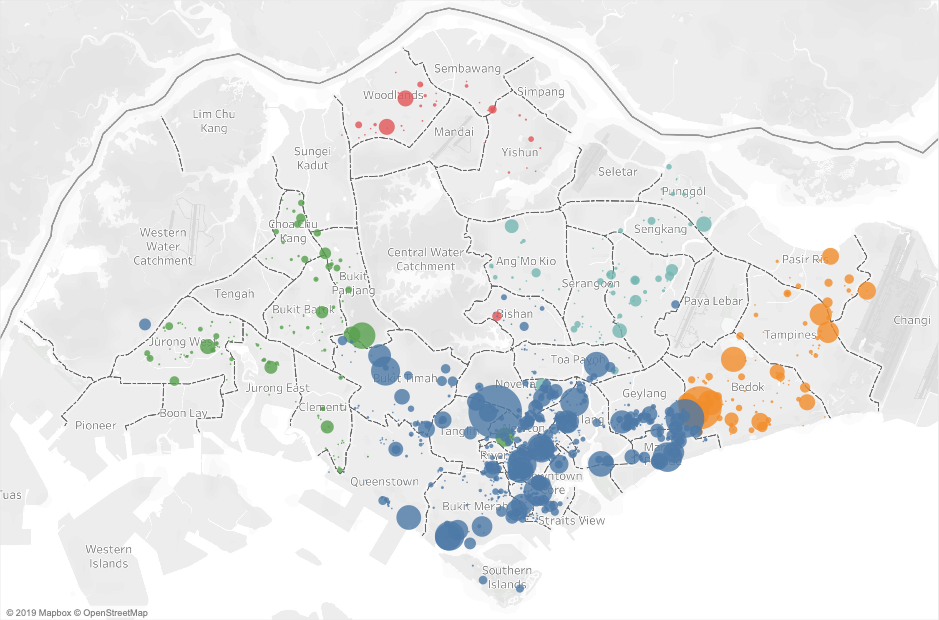
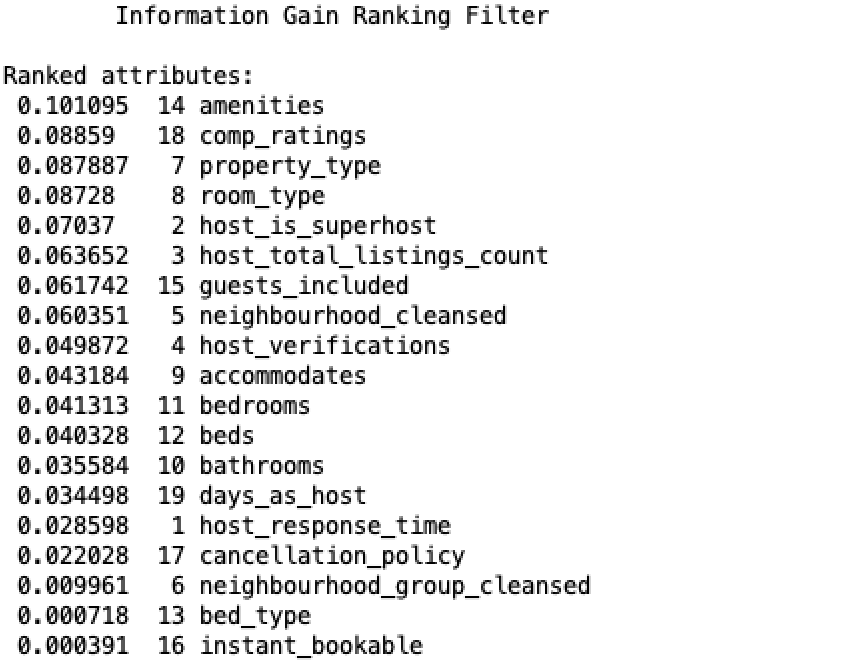
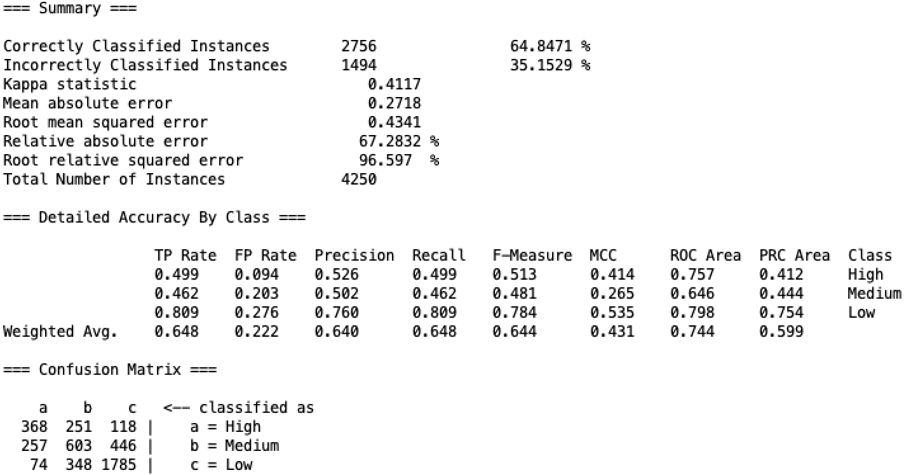

```{r setup, include=FALSE}
knitr::opts_chunk$set(echo = TRUE)
library(tidyverse)
library(ggridges)
df <- read_csv("airbnbSG1119v2.csv")
tb <- df %>% 
  select(host_response_time,host_is_superhost,host_verifications,
         neighbourhood_cleansed,neighbourhood_group_cleansed,
         property_type,room_type,accommodates,bathrooms,bedrooms,
         beds,amenities,price,guests_included,instant_bookable,
         cancellation_policy,comp_ratings,days_as_host,success,success_ltm,revenue_est_total,number_of_reviews)
```


__*Abstract*---This project will analyse Singapore Airbnb data collected from crawling the platform's website, in order to understand the relationships between a listing's characteristics and its success in generating revenue. It also contrasts the relative performance between each Singaporean neighbourhood, before testing the abilities of relevant attributes in classifying the degree of success for an Airbnb listing.__

### I. INTRODUCTION
With the advent of the sharing economy, platforms participating in this new economy have grown increasingly popular among consumers over the past few years. The most significant of which is Airbnb, a platform where individuals can list either a portion or the entire space of their home to someone seeking a place to stay, in return for an additional source of income. The disruptive nature of Airbnb has fostered the rise of an informal tourism accommodation sector, given its appeal in providing certain features that are unavailable in traditional forms of tourist accommodation. These features range from the more "local" experiences of living like a local to the ability in staying outside of "touristy" areas, since Airbnb accommodations tend to be more scattered in a given locale [4]. Proponents argue that the additional room supply resulting from this platform fosters visitation to a destination, bringing along positive stimulation to the destination's economy [8]. However, not everyone is as welcoming over the arrival of Airbnb. After all, it is a direct competitor to lower and middle segments of the accommodations industry [7]. In the city-state of Singapore where budget hotels are a vulnerable sector, Airbnb is viewed as a threat to the marketplace mainly operated by economy hotel chains such as Hotel 81 Group and Fragance Group [6]. These concerns were well-grounded as Airbnb has recently been shown to severely affect the profits of these hotels [2]. 

As tourism is one of the main drivers for Singapore's GDP growth, opportunistic Singaporean citizens will continue to leverage the opportunity offered by Airbnb to supplement their incomes. The decrease in hotel profits demonstrates that some of these individuals are successful in utilising the platform to generate revenue. This then begs the question, what are the characteristics of a listing or an Airbnb host that contributes to its success in the context of Singapore? This will be the theme of this project and to answer this overarching question, the study will be broken down into three components. First, regression analysis will be conducted on three attributes to study their relationship to the success of a listing. These variables of interest are the reputation of a listing, the number of amenities offered, and the level of experience of the host. Next, the relative performance among different Singaporean neighbourhoods are studied to uncover insight into the locations housing successful listings. Finally, a decision tree classifier is implemented to investigate the ability of various attributes in predicting a listing's degree of success. The results are then discussed and limitations to the study are outlined. Recommendations for further extensions to this study were made, as well as a brief comment about the applicability of this study.

### II. RELATED WORK

*A. Who Benefits from the "Sharing" Economy of Airbnb?*  

This study investigated and compared the socio-economic conditions in areas of London that had benefitted from Airbnb - with areas that did not. They discovered that demand mainly came from touristic areas. However, these areas change over time and hinders the response of traditional regulations. The study then propose recommendations for regulating Airbnb [9].

*B. Trust and reputation in the sharing economy: The role of personal photos in Airbnb* 

This study investigated the effects that product and seller attributes have on consumer decisions made on Airbnb. In particular, it focused on the trustworthiness effects originating from a host's personal photos. Their hypotheses was confirmed as this visual information was shown to influence the listing price and the probability of being selected [3].

*C. Price determinants of sharing economy based accommodation rental: A study of listings from 33 cities on Airbnb.com*  

This study investigated the price determinants for an Airbnb listing and compared it to the price determinants of traditional accommodations. It discovered certain differences, where stars and chain affiliation that signalled quality in the hotel industry, were irrelevant to Airbnb rentals. It also identified many physical attributes that were important signals for quality, and found that host attributes were just as important in determining prices [11].

### III. OVERVIEW
```{r echo=FALSE, fig.cap="The distribution of Airbnb listings on a map of Singapore. The size of each circle indicate the size of a listing's estimated revenue. The colors indicate the different regions these listings belong to.", fig.align="center"}

```

There has been no shortage of research in studying the impacts of Airbnb, most literature direct their focus on the economic and regulatory aspects revolving this issue. These investigations tend to establish a macro perspective and when they do step into micro territory, less attention is paid to the beneficiaries of the Airbnb platform, namely the hosts that list their properties online. Therefore, this project wishes to uncover some insights from this less explored territory, and particularly in the context of Singapore. We have learnt much about the important price determinants for an Airbnb listing, where the types of amenities provided or certain physical attributes can influence whether a listing would command a premium price [11]. However, a higher price does not necessarily translate to better success when participating in this sharing economy. While price is certainly an important factor, relative demand levels need to be accounted for to better understand financial success. We know that better amenities mean higher prices, but we should also find out whether more amenities offered by a listing could impact revenues in a positive fashion. Another overlooked factor was the experience level of a host. Does a more experienced Airbnb host deliver a better product? And would that influence the listing's attractiveness and stimulate more demand? We also know the importance of location for a property listed on Airbnb, but how so on a local context? It would certainly be interesting to also discover how well these variables would perform, in the task of classifying the success for a given listing. The objective of this project is to understand the factors contributing to the success in a local context. Using Singapore as a case study, I set out to answer three main questions:

**RQ1** - *Does the experience of a host, reputation and number of amenities offered by an Airbnb listing influence its success?*

**RQ2** - *How does each Singaporean neighbourhood compare to the average performing neighbourhood?*

**RQ3** - *What other attributes contribute to the success of a listing and how well can they classify the level of success?*

### IV. DATASET
To answer these questions, I will need to analyse detailed data for each Airbnb listing in Singapore.

*A. Airbnb Data*  
Inside Airbnb [5] is an independent open source repository of detailed data for Airbnb listings across various cities. Its main objective is to bring data to the public debate over the effects of Airbnb on local communities. Inside Airbnb uses open source technologies to crawl Airbnb's website and collect the publicly available data before verifying, and aggregating the data. Because listings can be deleted from the Airbnb platform, the compiled data is therefore a snapshot of all listings available at a particular time. For the purpose of this study, I will utilise the most recent snapshot of Airbnb listings in Singapore. The 5.5Mb of data details each of 7857 Airbnb listings in Singapore up to the 26th of November 2019. There is a total of 106 variables representing various characteristics of both the listing and its host, as well as the features offered by each listing. It also provides information about the ratings and the number of reviews, which will be instrumental for this study.

### V. SOFTWARE AND TECHNIQUES
The following tools will be utilised to analyse Singapore's Airbnb data.

*A. R*  
R is an advanced data analysis tool that will be mainly used in this study. The libraries “ggridges”, “lubridate” and “NCmisc” will be used to extend its functionality, both in processing and visualising the data.

*B. Weka*  
Weka is a software tool that allows data analysis to be conducted via a graphical user interface. Weka will be used in this project for classification and to evaluate the attributes based on information gain.

*C. Tableau*  
Tableau is an intuitive dashboarding and visualisation software. It will be used to visualise Singapore's Airbnb data on a geographical map.


### VI. DATA CLEANING AND PROCESSING
In the Airbnb data, all attributes that are not relevant to answering our research questions are first removed. Columns that include mostly NULL values were removed, as well as the columns that contain the same values. For example, since we only investigate Airbnb data in the city state of Singapore, we remove the columns *country* and *state* as they contain the same values, which are not meaningful to the study. Next, attributes with price information are converted from strings into numbers for numerical analysis. 

For observations with missing values in their price attributes, they were replaced by the value zero. The *host_verifications* attribute contains information about each type of verification the host has undertaken. This includes information such as “email”, “facebook”, “government_id”, “manual_offline”, etc. which can be used as a measure for the host's level of trust and reputation. Unfortunately, it is formatted as a long string, which is inappropriate for use in regressions and classifications. Therefore, these strings are split, reformatted into lists, and then converted into a numerical value representing the total number of different verifications a host had undergone. 

The *amenities* attribute includes information about what each listing offers, from a set of possible amenities that include items such as “internet”, “pool”, “gym”, “free parking” etc. This is relevant information for our study, and since it shared the same formatting as the *host_verifications* attribute, it was processed in a similar fashion. Each element in *amenities* were transformed into a numerical value representing the total number of amenities offered in each listing. Next, string values in the attributes for superhost status, and instant booking were converted into binary values. Values in the variable *cancellation_policy* were converted into factors. The remaining variables were then used to compose measures that will be relevant to the study. These main measures were:

**Composite ratings (comp_ratings):** The dataset contained the ratings across each area of evaluation for a listing, but lacked an aggregate score. These variables were the review scores for rating (up to 100), accuracy (up to 10), cleanliness (up to 10), check in (up to 10), communication (up to 10), location (up to 10), and value (up to 10). These sum up to a total of 160 points where a higher number implied greater satisfaction from past guests. To represent a composite measure for a listing's reputation and to reduce the dimensions for analysis, these variables were aggregated and converted into a scale from 1-8. The equation is summarized below:

$$\begin{aligned} comp\_ratings &= 7(\frac{\Sigma_i^{7} \ ratings_i}{160})+1\end{aligned}$$  

**Host experience level (days_as_host):** The host's level of experience was defined in this study by the number of days that individual has been a host. This was calculated by taking the difference in number of days between the date an individual started as a host (*host_since*) and the date of the data snapshot (26th November 2019).

**Estimated occupancy (occupancy_est_total):** Occupancy in this study was defined as the number of nights stayed by guests. To estimate the occupancy over each listing's lifetime, the minimum number of nights allowed to stay (*minimum_nights*) was multiplied by the number of reviews (*number_of_reviews*). The use of number of reviews was appropriate given that people have been shown to leave reviews after their stay more than 70% of the time [9].

**Estimated revenue (revenue_est_total):** The success of an Airbnb listing was defined in this study by the amount of revenue it had accumulated over its lifetime. The lifetime revenue received per listing was estimated by multiplying the estimated occupancy derived earlier by the price charged per night (*price*) for that listing. This was the measure used to define success in this study, since high revenues imply a successful listing.

**Degree of Success (success):** To facilitate classification conducted in this study, estimated revenues were converted into factors with levels from “Low” to “Medium” to “High”. They represent the relative success rather than the level success measured by estimated revenue. “Low” success was defined as having revenues lower than the median performer, while “High” success was defined as having revenues higher than 80% of their peers. “Medium” success was then defined as performing better than the median performer but less than the 80th percentile.

Finally, outliers were removed from the variables *price*, *minimum_nights*, *occupancy_est_total* (it did not make sense for occupancy to be longer than the listing's existence) and *bedrooms* (number of bedrooms are generally uniform across apartment units, especially in a tight land market such as Singapore, a large number of bedrooms tend to suggest the listing is a hotel, hostel etc). Outliers were defined as 3 standard deviations from the mean.

### VII. METHOD
This section outlines the methods and approach the study had undertaken to answer the research questions.

**A. Approach**  
The main objective of this project was to unveil insights about the characteristics contributing to the success of an Airbnb listing in Singapore. In this study, success is defined by the revenues accumulated over the lifetime of an Airbnb listing. I first studied the relationships that aggregate ratings, number of amenities, and the host's experience level had between the estimated revenue of a listing. I then studied which Singaporean neighbourhoods tend to be populated by the relatively more successful listings. The method used for these investigations was Ordinary Least Squares (OLS), running univariate linear regression models with *revenue_est_total* as the dependent variable. Due to the skewed nature in the distribution of estimated revenues, log-transformation was applied to improve its conformity to the normality assumption for variance in OLS. The equation is as follows:
$$\begin{aligned} ln(Y_i)=\beta_0+\beta_1X_i+\epsilon_i\end{aligned}$$
where $Y_i$ is the log-transformed revenues, and $X_i$ represents each of the attribute mentioned for study.

To study the relative performance between neighbourhoods, the average performing neighbourhood was first identified by comparing the mean revenue of each neighbourhood to the median revenue across Singapore. Regression was then conducted with the identified neighbourhood set as the first factor level. Next, to investigate the existence of influence - that other attributes may have on a listing's success, a decision tree classifier was implemented to partition the data via binary splits dependent on information gain. The classifier was cross-validated with 10 folds and the importance of each attribute was evaluated based on their information gain.

### VIII. ANALYSIS AND RESULTS
*A. Preliminary Analysis*  

```{r fig.cap="The Pearson Product-Moment Correlation matrix across each numerical attribute of interest in the Airbnb data", fig.height=5, fig.width=6, echo=FALSE, message=FALSE}
library(corrplot)
tb_cor <- df %>% 
  select(revenue_est_total,amenities,comp_ratings,days_as_host,host_verifications,accommodates,bathrooms,bedrooms,beds,price,guests_included,number_of_reviews)
M<-cor(tb_cor)
corrplot(M, method="color", addCoef.col="black", tl.col="black", number.cex=0.7, tl.cex=0.8)
```


The study began by inspecting the pearson product-moment correlation matrix (Figure 2) computed over each numerical attribute of interest. Attention was focused on the first row, where we observe the correlations each numerical variable had with estimated revenue. Price and the number of reviews were clearly correlated with our measure for success since they were used in its computation. Remaining relevant to the study, we could see that the number of amenities, the ratings, and the host's level of experience were all positively correlated to our success measure. However, given that these numbers were close to zero, it suggested that their correlations are weak. These weak correlations were likely an artifact from the large variances present in the revenue distributions. Nonetheless, these correlations are positive, suggesting that the variables could contribute to the success of a listing.

```{r, message=FALSE, echo=FALSE, fig.height=7, fig.cap="Distributions of log-transformed revenues within each neighbourhood of Singapore. The colors indicate which region each neighbourhood belongs to (Red:Central, Yellow:East, Green:North, Blue:North-East, Pink:West)"}
tb %>% 
  #filter(revenue_est_total<=0.3e+05) %>% 
  ggplot(aes(x = log(revenue_est_total), y = neighbourhood_cleansed, fill=neighbourhood_group_cleansed)) + 
  geom_density_ridges(scale=6, size=0.1, alpha=0.7) +
  labs(title = "Distribution within neighbourhoods", x = "log(Estimated Revenue)", y = "Neighbourhood") +
  scale_fill_discrete(name = "Region") +
  #scale_x_continuous(expand = c(0.01, 0)) +
  #scale_y_discrete(expand = c(0.1, 0)) +
  #theme_ridges(font_size = 10, grid = FALSE) 
  theme_classic() +
  theme(legend.position = "none")
```

Next, the distributions of revenue within each Singaporean neighbourhood was inspected. The revenues were log-transformed due to the extreme skewness observed in the data. Observing Figure 3, it can be seen that for neighbourhoods belonging to the central region of Singapore, the cumulative mass within areas of high revenue - appear to be larger relative to those in other regions.

**RQ1. Revenue vs rating, amenities and host experience level**  

The first univariate model is fitted with the log-transformed estimated total revenue per listing as the dependent variable and the composite ratings computed earlier as the independent variable. The estimated coefficient $\beta=.4697$ showed a significant positive relationship between revenues and the composite ratings of that listing. Every unit increase in composite ratings was associated with a 59.95% increase in estimated revenue, *t(4248) = 13.34, p < .001,* $R^{2}$ *= .04*. This would imply that increasing the reputation (ratings) could dramatically increase the income one receives from that property. However, this factor alone only explained 4% of the variation in the data, given the model's coefficient of determination $R^{2}$ of 0.04. The fitted model can be seen against a scatter plot of revenues in Figure 4.

The second univariate model is fitted with the number of amenities offered per listing as the independent variable. The estimated coefficient $\beta=.064975$ also show a significantly positive relationship between revenues and the number of amenities available on the property. Every unit increase in the number of amenities offered - was associated with a 6.71% increase in its estimated revenue, *t(4248) = 26.87, p < .001,* $R^{2}$ *= .15*. This result would imply that it is within the interest of the Airbnb host to provide more amenities within their property. This model does better than the previous model given its higher coefficient of determination $R^{2}$ of 0.15, demonstrating that this factor alone explained 15% of the variation in revenues. Figure 5 displays this fitted model against a scatterplot of revenues.

The third univariate model is fitted with the number of days an individual had been a host as the independent variable. The estimated coefficient $\beta=.0003587$ shows a significantly positive relationship between revenues and the level of experience a host had in managing listings on Airbnb. Every additional day of experience being a host - was associated with a .04% increase in estimated revenues, *t(4248) = 10.07, p < .001,* $R^{2}$ *= .02*. This result provides some support to the hypothesis that the more experienced one is at being a host, the better the product they deliver. However, this factor alone only explained 2% of the variation in revenues, given its coefficient of determination $R^{2}$ of 0.02. Figure 6 shows this fitted model.

Although these variables were associated with a positive relationship to the success of an Airbnb listing, each variable on their own were shown to only explain a small portion in the variation of revenues. When combining these variables together we slightly improved our model's explainability $R^{2}$ to 0.1819. These results imply that there are other factors at play when determining the success of a listing.

```{r echo=FALSE, message=FALSE, warning=FALSE, fig.cap="Estimated revenue vs reputation"}
lm.fit3 <- lm(log(revenue_est_total)~comp_ratings, tb)
#summary(lm.fit3)
preds3 <- predict(lm.fit3)
tb %>% 
  ggplot(aes(x=comp_ratings, y=log(revenue_est_total), color=host_is_superhost)) +
  #ylim(0,1e+05) +
  geom_point(alpha=0.3) +
  geom_line(aes(y=preds3), color='blue') +
  theme_classic() +
  labs(title = "Estimated Revenue vs Composite Rating", x = "Composite Rating", y = "ln(Estimated total revenue)") +
  scale_color_discrete(name = "Is Superhost")
```


```{r echo=FALSE, message=FALSE, warning=FALSE, fig.cap="Estimated revenue vs number of offered amenities"}
lm.fit4 <- lm(log(revenue_est_total)~amenities, tb)
#summary(lm.fit4)
preds4 <- predict(lm.fit4)
tb %>% 
  ggplot(aes(x=amenities, y=log(revenue_est_total), color=host_is_superhost)) +
  #ylim(0,1e+05) +
  geom_point(alpha=0.3) +
  geom_line(aes(y=preds4), color='blue') +
  theme_classic() +
  labs(title = "Estimated Revenue vs Amenities", x = "Number of amenities available", y = "ln(Estimated total revenue)") +
  scale_color_discrete(name = "Is Superhost")
```


```{r echo=FALSE, message=FALSE, warning=FALSE, fig.cap="Estimated revenue vs host's level of experience"}
lm.fit5 <- lm(log(revenue_est_total)~days_as_host, tb)
#summary(lm.fit5)
preds5 <- predict(lm.fit5)
tb %>% 
  ggplot(aes(x=days_as_host, y=log(revenue_est_total), color=host_is_superhost)) +
  #ylim(0,1e+05) +
  geom_point(alpha=0.3) +
  geom_line(aes(y=preds5), color='blue') +
  theme_classic() +
  labs(title = "Estimated Revenue vs Host Experience", x = "Number of days as host", y = "ln(Estimated total revenue)") +
  scale_color_discrete(name = "Is Superhost")
```

**RQ2. Relative performance among Singaporean neighbourhoods**  

After identifying the average performing neighbourhood to be "Bedok", another regression is conducted with the attribute *neighbourhood_cleansed* as the independent variable. *neighbourhood_cleansed* contains dozens of factor levels corresponding to each of the 40 neighbourhoods laid out in the data. The regression is carried out with "Bedok" as the first factor level, represented by the intercept. That way, we can interpret the coefficients of each neighbourhood in the regression as the relative performance to this average performing neighbourhood. The output below displays the 20 significant coefficients, representing the results on relative performance. The remaining 19 coefficients were not signficant. These neighbourhoods could be interpreted as having similar performance to our average performing neighbourhood "Bedok".
```{r echo=FALSE, message=FALSE, warning=FALSE, include=FALSE}
tb %>% 
  group_by(neighbourhood_cleansed) %>% 
  summarise(mean = mean(revenue_est_total)) %>%
  mutate(meanmean = mean(mean))
tb2 <- tb
tb2$neighbourhood_cleansed[tb2$neighbourhood_cleansed=="Bedok"] <- "aa" #so regression will compare to average performing neighbourhood
```


```{r echo=FALSE, message=FALSE, warning=FALSE}
fit2 <- lm(log(revenue_est_total)~neighbourhood_cleansed,tb2)
summary(fit2)
```


We can see that the neighbourhoods, Downtown Core, Geylang, Mandai, Marine Parade, Museum, Newton, Novena, Orchard, Outram, River Valley, and Tanglin were expected on average to generate higher revenues than in Bedok. We also see that the neighbourhoods, Bukit Batok, Bukit Merah, Jurong West, Punggol, Queenstown, Sembawang, Singapore River, Toa Payoh, and Woodlands were expected on average to generate less revenue compared to Bedok. It was interesting to see that in the Singapore River neighbourhood, where most tourist activity occurs, it was expected to command lower revenues than the average performing neigbourhood. These results bring valuable insight to any individual seeking to invest in property for the purpose of listing it on Airbnb. Perhaps one could increase their rental margins if they could identify an inexpensive neighbourhood where revenues are comparable to the better performers.

**RQ3. Importance of other attributes on performance**  

To investigate whether other attributes contribute to the success of an Airbnb listing, *Weka* software was used to rank relevant attributes by their information gain. Information gain measures how informative an attribute is based on their calculated entropy. The attributes related to pricing, occupancy, and revenue were not included in the evaluation. This was because they were correlated to our *success* class attribute by construction and thus would not be informative to our research question. The output is shown in Figure 8, where the attributes with higher information gain are displayed higher on the list. Complementary to the attributes we had investigated earlier using regression, we can see that physical characteristics of the listing such as property type, room type, and the number of bedrooms etc. also carried influence on the success of a listing. Characteristics of the host such as whether he/she is a superhost, the number of listings a host manage, or how many verifications a host ha undertaken etc. also contributed to a listing's success. We also discover that the type of bed, the neighbourhood group the listing belongs to, and whether the listing can be booked instantly, were attributes that were not very influential in the listing's success.


```{r echo=FALSE, fig.cap="Attributes of interest ranked in terms of their information gain"}

```


Given this information about the "informativeness" of each attribute, a decision tree classifier was built to investigate how well these attributes would perform in classifying whether a listing was successful. Since neighbourhood group, bed type and instant bookable were not informative variables, they were excluded from the model fitting process. The decision tree classifier was implemented using *Weka* with binary splits based on information gain (J48), it was also cross-validated across 10 folds. A summary of the model statistics is shown in Figure 9.


```{r echo=FALSE, fig.cap="Summary statistics for the J48 decision tree classifier implemented in *Weka*"}

```


The decision tree classifier had correctly classified 64.8% of 4250 instances, implying that it was reasonably good in predicting whether the success of an Airbnb listing was "High", "Medium" or "Low". The quality of this classifier was then evaluated by the Kappa statistic and its Receiver Operating Characteristic (ROC). The Kappa statistic is a measure of how close a classifier is to random guessing, where a value close to 1 represents perfect classification and a value close to 0 represents random guessing. The ROC conducts a similar quality evaluation, where a value of 0.5 represents random guessing and a value close to 1 represents a classification of high quality. Our decision tree model had a Kappa statistic of 0.412 and a weighted average ROC of 0.744, this implies that our model is of reasonable quality.

### IX. CONCLUSION
The aim of this project was to uncover insights on the characteristics contributing to the success of an Airbnb listing. Results from regression analysis demonstrated a significant positive relationship between success and the aggregate ratings of a property. Significant positive relationships were also found with the number of amenities offered in an Airbnb listing, as well as the level of experience from its host. However, these factors individually could only explain a fraction of the variance observed in the different levels of success observed in the data. When comparing to the neighbourhood "Bedok", the study also found significant differences in average revenues between Singaporean neighbourhoods. Then, a deeper look into the information gain from each variable of interest, revealed the importance of other attributes in their contributions to the success of a listing. Finally, the resulting decision tree classifier built using these variables classified the degree of success with decent accuracy, providing evidence that many other factors are at play in influencing its success. These results suggest that further research is needed to better understand the underlying mechanisms driving these influences on the success of an Airbnb listing.

*A. Limitations*  
This project has three main limitations. The first is that the analysis was conducted based on a snapshot of the current state of Airbnb listings in Singapore. This characteristic naturally limits our ability to study the temporal evolution of the successfulness among Airbnb listings in Singapore over time. This limitation also exaggerated the second limitation of this study, which stems from the regulatory changes that had recently been made in Singapore's property market. Singapore's Urban Redevelopment Authority (URA) stipulated that it is now illegal for private homes to accommodate occupants for less than three consecutive months [1]. This dynamic shift had very likely affected the accuracy of the assumptions made in this project, in the estimations of occupancy and revenue. Given the likelihood that hosts have changed their minimum nights of stay to 90 days - in compliance to the new regulations, multiplying that with the number of reviews for each listing would translate into inflated estimates for occupancy and revenue. Thus, limiting the accuracy of the results observed in this study. Finally, in the absence of cost information for maintaining an Airbnb listing, a better measure for success such as profit was out of reach for the purposes in this study.

*B. Recommendations*  
Congruent to the attributes used in this study, the Airbnb dataset also included numerous rich text variables such as the description of each listing, as well as written reviews. These variables were left unexplored in this study due to the requirement for sophisticated natural language processing techniques to extract useful information from these variables. They would also need to be converted into appropriate features before they could be utilised in classification. Therefore, one recommendation for further research would be to implement these more sophisticated methods and incorporate these variables. The inclusion of these potentially more informative information could significantly improve the quality and predictive power of our classifier, as well as allowing us to ascertain new insights.

*C. Applications*  
The main takeaway in this study is that there are many factors contributing to the success of an Airbnb listing, measured in terms of revenue. The applicability of these results will thus be dependent on each aspiring Airbnb host. Feasible ideas from this study such as increasing the number of amenities could be implemented to improve a current host's success. It could also be leveraged to inform the decision making process of aspiring entrants into the Singapore market. Such as decisions on what attributes to direct focus to in order to increase the likelihood of success for their future listings on Airbnb. However, given the weak correlations between the numeric attributes as well as the low coefficient of determinations obtained from our regression analysis, it is not certain how far the applicability of these results could extend into implementation. The results in this study provides insight but should not be taken as definitive advice.


### REFERENCES
[1] Aravindan, A., Geddie, J., (2017) 'Airbnb pushes back on Singapore's tough home rental rules', *Reuters, Singapore,* 8 December. Available at: https://www.reuters.com/article/us-singapore-airbnb-idUSKBN1E20H4 (Accessed: 18 December 2019).

[2] Chua, E.L., Chiu, J.L. and Bool, N.C., 2019. Sharing Economy: An Analysis of Airbnb Business Model and the Factors that Influence Consumer Adoption. *Review of Integrative Business and Economics Research, 8*, p.19.

[3] Ert, E., Fleischer, A. and Magen, N., 2016. Trust and reputation in the sharing economy: The role of personal photos in Airbnb. *Tourism Management, 55*, pp.62-73.

[4] Guttentag, D., 2015. Airbnb: disruptive innovation and the rise of an informal tourism accommodation sector. *Current issues in Tourism, 18*(12), pp.1192-1217.

[5] Inside Airbnb. 2019. Get the Data. [ONLINE] Available at: http://insideairbnb.com/get-the-data.html. [Accessed 18 December 2019].

[6] Koh, E. and King, B., 2017. Accommodating the sharing revolution: a qualitative evaluation of the impact of Airbnb on Singapore’s budget hotels. *Tourism recreation research, 42*(4), pp.409-421.

[7] Manchester, E.A., 2017. *Sharing economy-disrupting established industries: A case study of Airbnb disrupting the hotel industry* (Bachelor's thesis).

[8] Porges, S. (2013) 'The Airbnb effect: Bringing life to quiet neighborhoods.' *Forbes*, 23 January. Available at: http://www.forbes.com/sites/sethporges/2013/01/23/the-airbnb-effect-bringing-life-to-quiet-neighborhoods/. [Accessed 18 December 2019].

[9] Quattrone, G., Proserpio, D., Quercia, D., Capra, L. and Musolesi, M., 2016, April. Who benefits from the sharing economy of Airbnb?. *In Proceedings of the 25th international conference on world wide web* (pp. 1385-1394). International World Wide Web Conferences Steering Committee.

[10] Volgger, M., Taplin, R. and Pforr, C., 2019. The evolution of ‘Airbnb-tourism’: Demand-side dynamics around international use of peer-to-peer accommodation in Australia. *Annals of Tourism Research, 75*, pp.322-337.

[11] Wang, D. and Nicolau, J.L., 2017. Price determinants of sharing economy based accommodation rental: A study of listings from 33 cities on Airbnb. com. *International Journal of Hospitality Management, 62*, pp.120-131.


